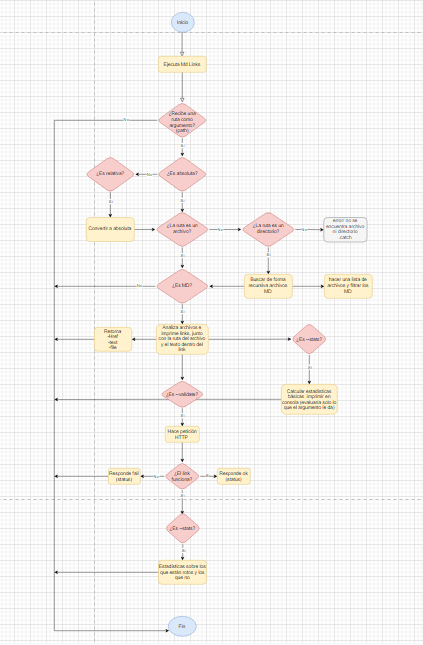
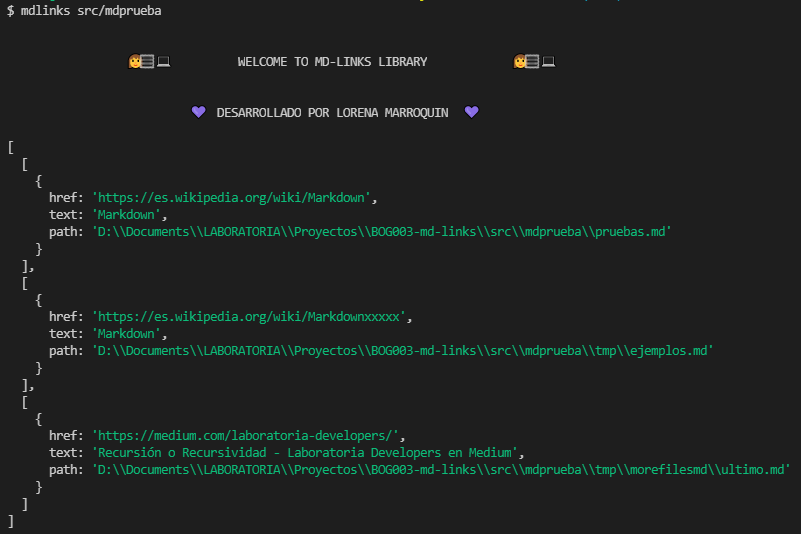
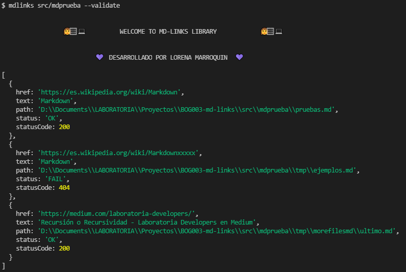
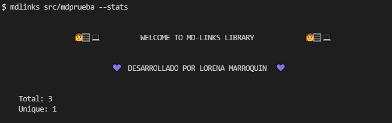
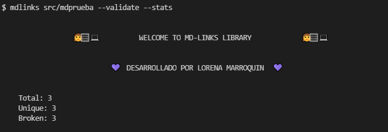
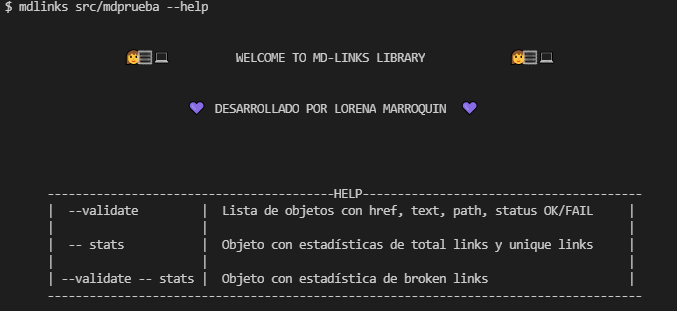
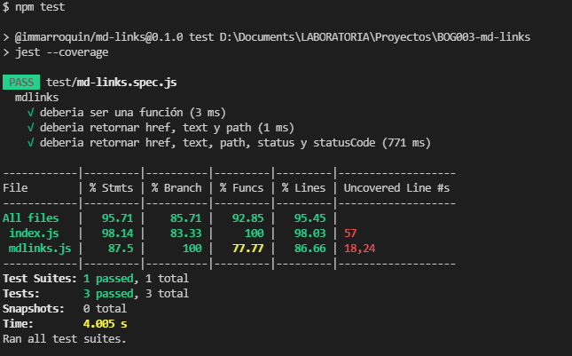

# Markdown Links  

## Índice

* [1. Preámbulo](#1-preámbulo)
* [2. Resumen del proyecto](#2-resumen-del-proyecto)
* [3. Descripción de la libreria](#3-descripción-de-la-libreria)
* [4. Test asincrono](#4-test-asincrono)

***

## 1. Preámbulo

[Markdown](https://es.wikipedia.org/wiki/Markdown) es un lenguaje de marcado
ligero muy popular entre developers. Es usado en muchísimas plataformas que
manejan texto plano (GitHub, foros, blogs, ...), y es muy común
encontrar varios archivos en ese formato en cualquier tipo de repositorio
(empezando por el tradicional `README.md`).

Estos archivos `Markdown` normalmente contienen _links_ (vínculos/ligas) que
muchas veces están rotos o ya no son válidos y eso perjudica mucho el valor de
la información que se quiere compartir.

Dentro de una comunidad de código abierto, nos han propuesto crear una
herramienta usando [Node.js](https://nodejs.org/), que lea y analice archivos
en formato `Markdown`, para verificar los links que contengan y reportar
algunas estadísticas.

## 2. Resumen del proyecto

Este proyecto es una librería de Node.js que permite leer, analizar, extraer y generar estadísticas de los links de un archivo o directorio en formato .md

1. Realice un diagrama de flujo con la interfaz que debe llevar la CLI

2. JavaScript API 
- Recibe una ruta absoluta o relativa al archivo o directorio y siempre que sea relativa la convertira en absoluta. 
- Recibe validate que es un booleano que determina si se desea validar los links encontrados. 

3. CLI (Command Line Interface)

## 3. Descripción de la libreria
La aplicación se ejecuta de la siguiente manera a través de la terminal:

mdlinks path-to-file [options]

Si ingresas una ruta valida sea archivo o directorio

Si ingresas una ruta valida con la opción --validate

Si ingresas una ruta valida con la opción --stats

Si ingresas una ruta valida con la opción --validate --stats

Si necesitas recordar los comandos puedes poner la opción --help

## 4. Test asincrono 
